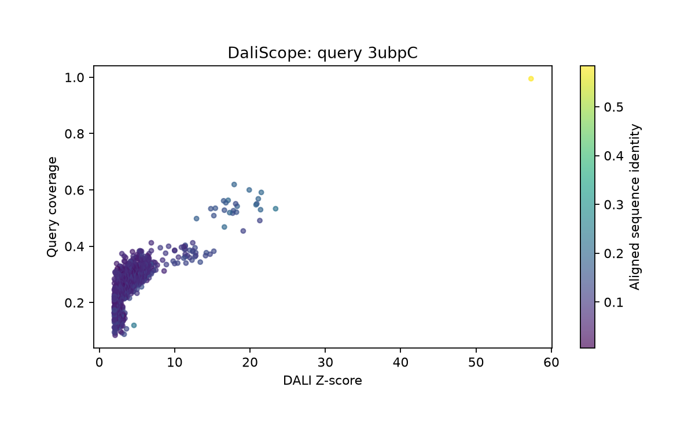

# DaliScope

DaliScope is a notebook-based toolkit for exploring DALI structural search results. It combines domain-level filtering, Pfam annotation, sequence and secondary-structure profiles, interactive 3D views, motif analysis, and structural community detection.

DaliScope analyzes an existing [DALI data pack](http://ekhidna2.biocenter.helsinki.fi/dali/colab.html), which is self-contained and includes Pfam data.



## Browse HTML example outputs — no code required

Open the saved **HTML example outputs** directly in your browser. No installation or code execution is needed.

- [WorkedExample1 — HTML example output](https://liisa-holm-group.github.io/DaliScope/example-outputs/WorkedExample1.html): multidomain analysis and sequence signatures.
- [WorkedExample2 — HTML example output](https://liisa-holm-group.github.io/DaliScope/example-outputs/WorkedExample2.html): GOLD fold communities and structural clustering.

These saved examples include figures, tables, and text. Run the notebooks for Python-backed interactive controls. See [source and provenance](docs/example-outputs/README.md) for export details.

## Run in your browser with Colab

Start with **[01_quickstart.ipynb in Colab](https://colab.research.google.com/github/Liisa-Holm-group/DaliScope/blob/v0.1.7/notebooks/01_quickstart.ipynb)**. Connect to a CPU runtime, then choose **Runtime → Run all**. The setup cell installs DaliScope, downloads the example data, and enables interactive controls automatically. You do not need to install Python locally or manually download release attachments.

| Notebook | Purpose | Colab |
| --- | --- | --- |
| `01_quickstart.ipynb` | Short introduction; included 3ubpC pack | [Open in Colab](https://colab.research.google.com/github/Liisa-Holm-group/DaliScope/blob/v0.1.7/notebooks/01_quickstart.ipynb) |
| `RunDaliScope.ipynb` | Comprehensive domain and motif workflow; included 3ubpC pack | [Open in Colab](https://colab.research.google.com/github/Liisa-Holm-group/DaliScope/blob/v0.1.7/notebooks/RunDaliScope.ipynb) |
| `WorkedExample1.ipynb` | Multidomain and sequence-signature case study; included ZN pack | [Open in Colab](https://colab.research.google.com/github/Liisa-Holm-group/DaliScope/blob/v0.1.7/notebooks/WorkedExample1.ipynb) |
| `WorkedExample2.ipynb` | GOLD fold communities; automatically downloads the optional GOLD pack in Colab | [Open in Colab](https://colab.research.google.com/github/Liisa-Holm-group/DaliScope/blob/v0.1.7/notebooks/WorkedExample2.ipynb) |

To analyze your own DALI data pack, open **[RunDaliScope in Colab](https://colab.research.google.com/github/Liisa-Holm-group/DaliScope/blob/v0.1.7/notebooks/RunDaliScope.ipynb)** and paste its direct download URL into the **`pack_source`** field before choosing **Runtime → Run all**. You can also enter a file path accessible to the notebook runtime. Copy the archive download link, rather than the DALI results-page URL, and keep a permanent copy of the input pack. See [your own pack and the server launch link](docs/colab.md#use-your-own-dali-data-pack) for the steps.

These links use **v0.1.7** so notebook code and installed source match. To change data, domains, filters, or motifs, reload a fresh project and execute subsequent sections in order. See the [Colab guide](docs/colab.md) for setup, interactive controls, and downloading results.

## Run locally with Python 3.12

Use **Python 3.12** for the reference environment. Check `python --version` before creating the environment; the commands below assume it reports 3.12. If your default Python is 3.13, install/select Python 3.12 and use its executable for the venv command, or use the independent Conda alternative below. The package declares Python 3.10 or newer; tested platform/version coverage is recorded in [validation](docs/validation.md).

```bash
git clone --branch v0.1.7 https://github.com/Liisa-Holm-group/DaliScope.git
cd DaliScope
python -m venv .venv
```

Activate the environment on Linux/macOS:

```bash
source .venv/bin/activate
```

Or on Windows PowerShell:

```powershell
.\.venv\Scripts\Activate.ps1
```

If PowerShell does not allow activation, use `.\.venv\Scripts\python.exe` in place of `python` in the following commands.

```bash
python -m pip install --upgrade pip
python -m pip install -e ".[notebook]"
python -m ipykernel install --user --name daliscope --display-name "Python (DaliScope)"
python -m jupyterlab
```

Open **`notebooks/01_quickstart.ipynb`**, select the **Python (DaliScope)** kernel, and run the cells from top to bottom. The small `3ubpC_PDB25.tar.gz` example is included in the repository. The notebook loads it, plots the hit landscape and domain architecture, creates a filtered view, shows a 3D superimposition, and saves a session. The Colab setup cell performs no installation in a local notebook.

### Update an existing installation

Activate the existing DaliScope environment and run these commands from the repository root:

```bash
git fetch origin --tags
git checkout v0.1.7
python -m pip install -e ".[notebook]"
```

Restart the notebook kernel after updating, then reopen the notebook from the repository and run it from the beginning. Keep your saved analyses and input packs. The existing environment can be reused.

### Optional Conda alternative

If you already use Conda, clone the repository as above, enter its root directory, and use these commands **instead of creating a venv**. `conda run` does not require shell activation:

```bash
conda create -n daliscope python=3.12 pip -y
conda run -n daliscope python -m pip install -e ".[notebook]"
conda run -n daliscope python -m ipykernel install --user --name daliscope --display-name "Python (DaliScope)"
conda run --no-capture-output -n daliscope python -m jupyterlab
```

## Documentation

- [Colab guide](docs/colab.md): browser setup, interactive controls, and cloud outputs.
- [Usage guide](docs/usage.md): choosing data, views, parameters, plots, and saved sessions.
- [Data-pack format](docs/data-format.md): required files, table columns, and coordinate conventions.
- [Preparing your own data](docs/prepare-data.md): a portable pack generator and its database requirements.
- [Examples and data provenance](notebooks/data/README.md): included datasets and the optional GOLD download.
- [Validation](docs/validation.md): checks performed and practical limitations.
- [Release notes](docs/release-notes.md): current changes and version history.

## Minimal Python example

Run this from the repository root after installation:

```python
from daliscope.core.project import Project

project = Project.load_pack("notebooks/data/3ubpC_PDB25.tar.gz")
full_view = next(iter(project.views))
hits = project.views[full_view]
print(project.query_identifier, project.query_length, len(hits))
print(hits[["target_id", "z_score", "query_coverage", "rmsd"]].head())
```

The default view is named `dom_0-<query_length>`. Discover the view name or use the name returned by the notebook loading helper.

## Development

```bash
python -m pip install -e ".[notebook,packer,dev]"
python -m pytest -q
python -m build
```

Tests exercise the bundled example, session persistence, optional annotations, database namespace handling, and graph partition input. GitHub Actions also runs the quickstart notebook in a fresh kernel. For release maintenance, see the [publishing guide](docs/publishing.md).

## Contact and citation

Maintained by the **Liisa Holm group**. Contact: **hao.liu@helsinki.fi**.

A manuscript describing DaliScope is being prepared for submission. Publication details will be added when available. When reporting an analysis, record the DaliScope version, data-pack checksum, selected domains, filters, and clustering/motif parameters, and cite DALI and the annotation sources used in your work.

## Licensing

DaliScope code and its original documentation are distributed under the [MIT License](LICENSE), copyright 2026 Liisa Holm group. Third-party structures and annotations retain their source providers' terms; see the [data provenance notes](notebooks/data/README.md). A software license does not replace the licenses of source data or accompanying publications.

The bundled [Pfam 38.2 descriptions reference](daliscope/packer/data/README.md) is distributed under CC0-1.0, with its upstream source and checksums recorded separately.
